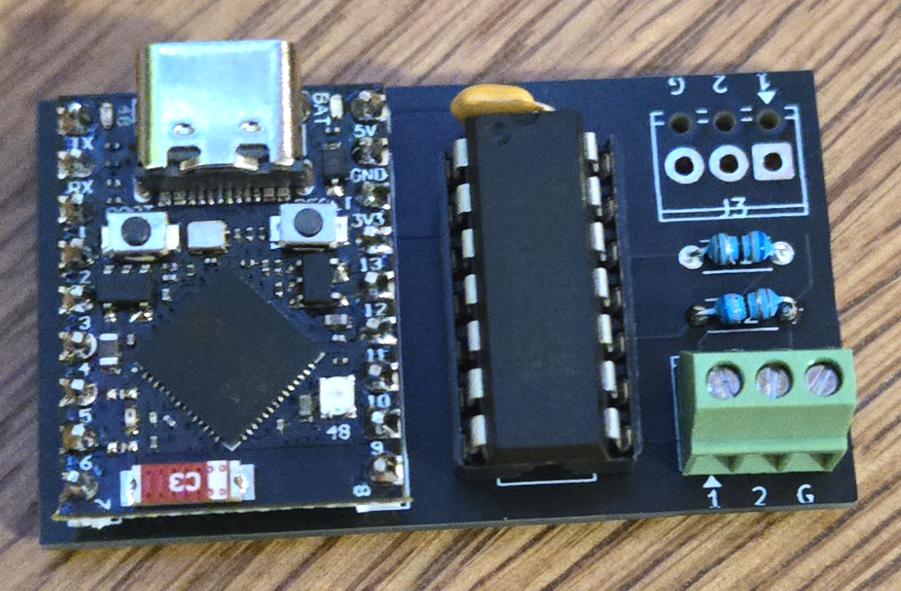
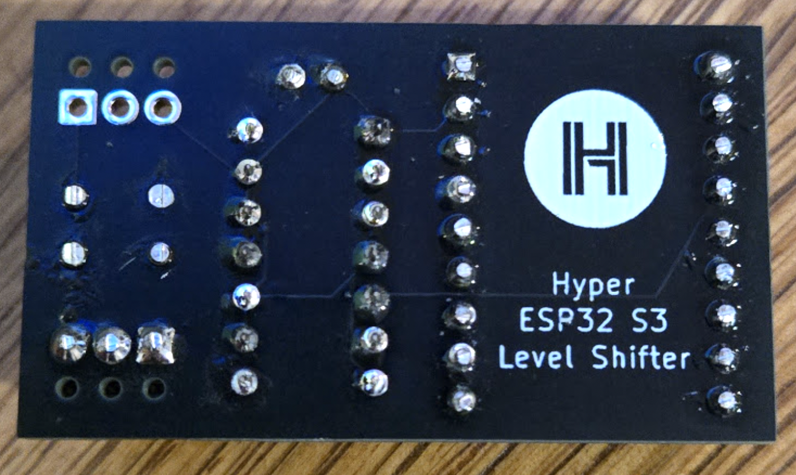

# Hyper Level Shifter

A simple through-hole PCB that pairs an ESP32-S3 Super Mini with a SN74AHCT125N quad bus buffer to shift 3.3V GPIO signals up to 5V logic — designed for driving WS2812B/SK6812 LED strips with [Hyperk](https://github.com/awawa-dev/Hyperk) / [HyperHDR](https://github.com/awawa-dev/HyperHDR) ambilight setups.

<table><tr>
<td></td>
<td></td>
</tr><tr>
<td align="center">Front</td>
<td align="center">Back</td>
</tr></table>

**[Download Gerbers (ZIP)](https://github.com/seanuleh/supermini-level-shifter/raw/main/manufacturing/default/default.gerber.zip)** — ready for JLCPCB / PCBWay (order bare PCB only)

## Features

- Socket for ESP32-S3 Super Mini (2× 1×9 female 2.54mm headers)
- DIP-14 socket for SN74AHCT125N logic level shifter (3.3V → 5V)
- Dual 3-pin 2.54mm screw terminals (top + bottom — choose whichever orientation suits your wiring)
- 68Ω series resistors on data outputs for signal integrity
- 100nF decoupling capacitor on IC VCC
- All through-hole components — no SMD soldering required

## Screw Terminal Pinout

Both terminals are electrically identical:

| Pin | Signal | Description |
|-----|--------|-------------|
| 1   | DATA1  | GP1 level-shifted (5V logic) — LED segment 1 |
| 2   | DATA2  | GP2 level-shifted (5V logic) — LED segment 2 |
| 3   | GND    | Ground reference |

> Power (5V) for the LED strips should come from a dedicated 5V supply, not the ESP32.

## Signal Path

```
ESP32 GP1 (3.3V) → SN74AHCT125N 1A → 1Y → 68Ω → Terminal pin 1
ESP32 GP2 (3.3V) → SN74AHCT125N 2A → 2Y → 68Ω → Terminal pin 2
ESP32 GND ──────────────────────────────────────→ Terminal pin 3
ESP32 5V  ──────────────────────────────────────→ IC VCC (pin 14)
```

## BOM

All parts are hand-soldered. No JLCPCB assembly required — order the bare PCB only.

| Ref | Part | Notes |
|-----|------|-------|
| J1, J2 | 1×9 female 2.54mm pin header | 2× required |
| U1 | SN74AHCT125N | DIP-14, e.g. LCSC C5907 |
| — | DIP-14 IC socket | Order separately |
| J3, J4 | 3-pin 2.54mm screw terminal | e.g. KF128-2.54-3P, Phoenix MPT-0.5/3-2.54 |
| R1, R2 | 68Ω 1/8W axial resistor | Any 62–100Ω 1/8W axial |
| C1 | 100nF ceramic disc capacitor | 50V, 2.5mm pitch |

## Assembly Notes

- Install the DIP-14 socket first, then insert the SN74AHCT125N IC into the socket
- ESP32-S3 Super Mini plugs into J1/J2 with USB-C port facing toward the "USB Port ↑" silkscreen label
- The decoupling cap (C1) is non-polarised — orientation doesn't matter
- LED strip power should come from a dedicated 5V PSU; the ESP32 5V pin cannot source enough current for a full TV ambilight run

## Project Structure

Built with [atopile](https://atopile.io) 0.15.x.

```
ato.yaml                        # Build config
elec/src/
  level_shifter.ato             # Top-level module
  esp32s3_super_mini.ato        # ESP32 socket module
  parts/
    Header1x9F/                 # 1×9 female header
    SN74AHCT125N/               # DIP-14 quad buffer
    ScrewTerminal_2.54_3P/      # 3-pin screw terminal
    Resistor_TH_68R/            # 68Ω axial resistor
    Capacitor_TH_100nF/         # 100nF ceramic disc cap
elec/layouts/default/           # KiCAD PCB layout
```
